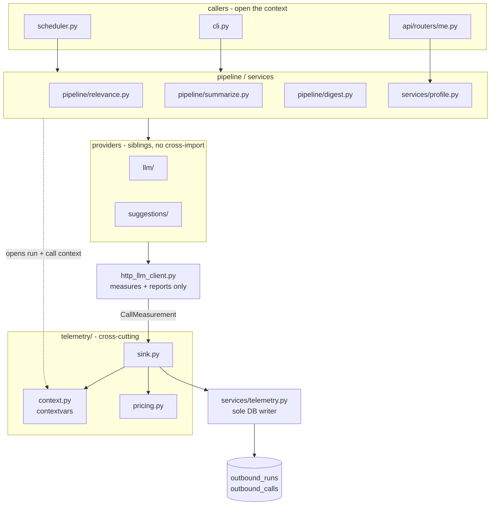
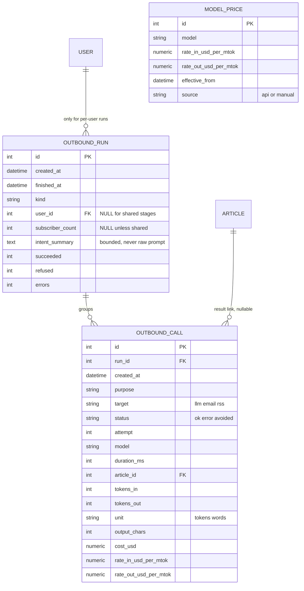

# Architecture Spine — Outbound Call Telemetry

**המטרה שממנה נגזר הכל:** לענות אם המוצר רווחי והגיוני. זו לא מערכת חשבונאות — היא מערכת שאמורה להפוך **בזבוז** לשאילתה. כל החלטה כאן נמדדת מול השאלה הזאת.

**מספור ה-AD ממשיך מ-AD-10** של הספיין הקודם (`architecture-news-agent-2026-07-22`), כדי ששני הספיינים יוכלו להיות מצוטטים יחד בלי התנגשות מזהים.

## Design Paradigm

הפרדיגמה הקיימת נשארת: routers → services → models, plus ספקים ניתנים להחלפה (Strategy + factory). מעליה נוספת שכבה חוצה אחת — **ambient-context telemetry**:

| התפקיד | מי ממלא אותו | איפה |
| --- | --- | --- |
| מודד | שכבת התחבורה המשותפת | `http_llm_client.py` |
| מייחס | הקשר פעיל (`contextvars`) שהקורא פותח | `newsagent/telemetry/context.py` |
| כותב | שירות דומיין | `newsagent/services/telemetry.py` |

שלושת התפקידים לא מתערבבים. זה כל הרעיון: המודד לא יודע בשביל מה, המייחס לא יודע כמה, והכותב לא נוגע ברשת.

`newsagent/telemetry/` הוא חבילה חדשה בצורת `llm/` ו-`suggestions/` (AD-3), אבל **היא לא ספק** — היא תשתית חוצה, ולכן מותר גם ל-`llm/` וגם ל-`suggestions/` לתלות בה. היא לא תולה באף אחת מהן.

## Inherited Invariants

| Inherited | From parent | Binds here |
| --- | --- | --- |
| AD-1 — thin-router / domain-service | `architecture-news-agent-2026-07-22` | רק `services/telemetry.py` כותב ל-DB. אף ספק ואף מודול תחבורה לא כותב. |
| AD-3 — `llm/` ו-`suggestions/` אחים ללא ייבוא צולב | ספיין 2026-07-22 | `telemetry/` לא הופכת אותם לתלויים זה בזה; שתיהן תולות בה, היא לא בהן. |
| AD-4 — Alembic היחיד | ספיין 2026-07-22 | שתי הטבלאות החדשות והמחיקה של `pipeline_runs` נוסעות ברוויזיה אחת מעל `d4a7b2c85f16`. |

**קונפליקט מוצהר עם קונבנציית ההורה:** הספיין ההורה קובע שהגדרות חדשות נושאות קידומת `NEWSAGENT_`. הקוד בפועל סותר את זה במשפחה הרלוונטית — `EXTERNAL_LLM_BASE_URL`, `LOCAL_LLM_MODEL` ודומיהן **חסרות קידומת**. תצורת המחירון שייכת למשפחה הזאת. ההכרעה כאן: **ללכת אחרי הקוד, לא אחרי הקונבנציה** (ראה טבלת הקונבנציות). זה חריג מודע, לא היסח דעת.

## Invariants & Rules

### AD-11 — הקשר פעיל הוא החיבור היחיד בין כוונה למדידה

- **Binds:** `telemetry/context.py`, כל קורא שמפעיל עבודה יוצאת
- **Prevents:** שכל בונה יבחר בעצמו איך להעביר "בשביל מה הקריאה" מטה — פרמטר בחתימה אצל אחד, ערך מוחזר אצל שני, משתנה גלובלי אצל שלישי. ובעיקר: מונע קורא חדש שאינו מתועד כלל, שזה מצב `scheduler.py` היום.
- **Rule:** הזהות (סוג הפעולה, ה-FK לתוצאה, המשתמש) נמסרת **אך ורק** דרך `contextvars` שהקורא פותח כ-context manager. אסור להעביר אותה כפרמטר דרך `llm/`, `suggestions/` או `http_llm_client` — הוספת פרמטר כזה היא הפרה של ה-AD הזה, לא אופטימיזציה שלו. **קריאה שנעשית ללא הקשר פתוח נרשמת בכל זאת**, עם `purpose='UNATTRIBUTED'` ובלי FK. אסור שהיעדר הקשר ישתיק שורה.
- **שתי רמות קינון, ולא אחת — הגרנולריות קבועה כאן ולא נתונה לפרשנות:**
  - `open_run(kind, user_id=None, subscriber_count=None, intent_summary=None)` נפתח **פעם אחת לכל הפעלת שלב** — קריאה אחת ל-`filter_pending_articles`, ל-`summarize_relevant_articles`, ל-`build_digests` עבור משתמש אחד, או לפעולת הצעות אחת. **לא** אחת לכל כתבה.
  - `attribute_call(purpose, article_id=None)` נפתח **בתוך** הריצה, פעם אחת לכל יחידת עבודה — בדרך כלל כתבה. הוא מספק את ה-`purpose` ואת ה-FK לשורות שייכתבו בתוכו.
  - בונה שיפתח ריצה לכל כתבה מקיים את שאר האותיות של ה-AD אבל מייצר גרנולריות אחרת לגמרי, ו-`subscriber_count` מקבל אצלו משמעות שונה. הקינון הזה הוא מה שסוגר את הפער.
- **גבול מוצהר, לא להבטיח מעבר לו:** הכיסוי חל על כל מי שעובר בתחבורה המשותפת של הפרויקט. מפתח שיכתוב קריאת HTTP משלו ל-LLM ויעקוף את `send_chat_completion` — לא יתועד. אין עיצוב שמכסה את זה.

### AD-12 — התחבורה מודדת ומדווחת; לעולם לא כותבת ולא לומדת דומיין

- **Binds:** `http_llm_client.py`
- **Prevents:** שכתיבת DB או שפת דומיין (כתבה, נושא, משתמש) יזלגו לתוך המודול שמוצהר `Domain-free` — ובכיוון השני, שהמדידה תיעשה בכמה מקומות שונים ותיתן מספרים שונים.
- **Rule:** `send_chat_completion` מודד זמן שחלף סביב קריאת ה-HTTP ומדווח `CallMeasurement` (מודל, טוקנים נכנס/יוצא, `duration_ms`, סטטוס, מספר תווי הפלט) אל ה-sink הפעיל של `telemetry`. הוא **לא** ניגש ל-DB, **לא** מקבל `Session`, ו**לא** יודע מה הקריאה עשתה. הדיווח הוא ברירת מחדל — לא פרמטר שהקורא מחווט — אחרת חזרנו ל-opt-in. הפרמטר `on_usage` הקיים נשאר כנקודת הזרקה לבדיקות בלבד.

### AD-13 — שתי טבלאות: הקריאה היא האטום, הריצה היא ההקשר, הסכומים תמיד נגזרים

- **Binds:** `outbound_runs`, `outbound_calls`, `services/telemetry.py`
- **Prevents:** שני בעלים לאותה עובדה. אם סכום נשמר על האב וגם ניתן לחישוב מהילדים, הם יסטו — ושניהם ייראו נכונים.
- **Rule:** `outbound_calls` מחזיקה **הוצאה, זמן ותוצאה** — היא מקור האמת היחיד לכסף. `outbound_runs` מחזיקה **הקשר וספירות תוצאה** בלבד, כולל עבודה שמעולם לא ייצרה קריאה (דחיות כזבל, שגיאות לפני רשת) — אלה לא ניתנות לשחזור מהילדים כי לא עלו כסף. **סכומי הריצה — טוקנים, עלות, משך — הם תמיד `SUM` מעל הילדים ולעולם לא נשמרים כעמודה.** `tokens_total` גם הוא נגזר, לא נשמר.
- **שורת ריצה נוצרת תמיד**, גם לפעולה שהיא קריאה בודדת (הצעות נושאים, תפקידים). זה נוגד את ההצעה המקורית שאב נחוץ רק לפייפליין: פעולה בודדת שתגדל מחר לשתי קריאות תשנה צורה רטרואקטיבית, ו"מה המשתמש רצה" יחיה בשני מקומות תלוי בצורה. `intent_summary` שרצית לרשום לפעולה בודדת **הוא** השדה הזה על האב.
- **`subscriber_count` הוא מספר המשתמשים הפעילים המנויים על נושא כלשהו שהריצה נגעה בו** — לא סך המשתמשים במערכת ולא מספר המנויים לנושא בודד. בלי ההגדרה הזאת שני בונים יחשבו שני מספרים שונים ושניהם יקראו לזה "מנויים".
- **ספירות התוצאה נכתבות פעם אחת, בסגירת הריצה**, מתוך הדוח שהשלב כבר מחזיר (`FilterReport`, `SummarizeReport`, `DigestReport`) — לא בהגדלה הדרגתית תוך כדי. הגדלה הדרגתית פותחת מרוץ בין ריצות חופפות ומייצרת שורת ריצה חלקית אם התהליך נופל באמצע.

### AD-14 — ייחוס: שלבים משותפים לפי ריצה, לפי משתמש רק בבניית הדייג'סט

- **Binds:** `outbound_runs.user_id`, `outbound_runs.subscriber_count`
- **Prevents:** מספר per-user מומצא. `filter_pending_articles` ו-`summarize_relevant_articles` **אינם per-user** — כתבה מסוכמת פעם אחת ומוגשת לכל המנויים על הנושא. חלוקת העלות בין מנויים הייתה גורמת לאותה כתבה לעלות סכום אחר למשתמש רק כי מספר המנויים השתנה.
- **Rule:** `user_id` מאוכלס **רק** כשהעבודה נעשתה באמת עבור משתמש מסוים — `digest_build` ו-`profile_suggestions`. בשלבים המשותפים הוא `NULL`, ובמקומו `subscriber_count` נושא את מספר המנויים הרלוונטיים לריצה, כך ש"עלות למנוי לריצה" מחושבת ישירות. **אסור לפצל עלות של קריאה אחת בין כמה משתמשים.**

### AD-15 — שורה אחת לכל פניה, כולל ניסיונות חוזרים וקריאות שנחסכו

- **Binds:** `outbound_calls.attempt`, `outbound_calls.status`
- **Prevents:** מיזוג `retry` לתוך שורה אחת (ואז עלות הכישלונות בלתי ניתנת לבידוד), ובכיוון השני — שקאש שפוגע לא ישאיר עקבה ויגרום לעלות-לדייג'סט להיראות משתנה באקראי.
- **Rule:** כל ניסיון HTTP הוא שורה. ניסיונות של אותה פעולה חולקים `run_id` + `purpose` + `article_id` ונבדלים ב-`attempt`. דחייה כזבל אינה שורת קריאה — היא נספרת על הריצה, כי מעולם לא הגיעה לרשת.
- **`status` מקבל ארבעה ערכים, ומשמעותו היא "האם הקריאה הזאת ייצרה עבודה שמישה" — לא "האם ה-HTTP הצליח":**
  - `ok` — חזרה תוצאה שמישה.
  - `error` — כשל תחבורה (הספק נפל, timeout, סטטוס שגיאה). ייתכן שלא חויבו טוקנים כלל.
  - `malformed` — **HTTP 200, טוקנים חויבו, והפלט לא נפרס.** זה בזבוז טהור וחייב להיות נפרד מ-`error`: התיקון של `error` הוא זמינות, התיקון של `malformed` הוא פרומפט או סכימה. (הקוד כבר הכריע שהמקרה הזה חייב להיות נראה — `_on_usage` נורה לפני חילוץ התוכן בדיוק בשביל זה, GH #19.)
  - `avoided` — הקריאה נחסכה, ראה למטה.
- **השורה נכתבת בסגירת ה-attempt scope, לא ברגע הדיווח מהתחבורה.** התחבורה מדווחת לפני שידוע אם התוצאה שמישה, ולכן היא **לא יכולה** לדעת את הסטטוס הסופי; sink שמשטיח מיד יכתוב `ok` על קריאה שנכשלה מיד אחר כך. לכן ה-sink צובר, וה-attempt scope משטיח פעם אחת עם האמת הסופית — ברירת מחדל `ok`, וכל שכבה שמגלה שהתוצאה בלתי שמישה מסמנת `malformed` לפני ה-`raise`. AD-12 נשמר: התחבורה עדיין רק מודדת ומדווחת, היא פשוט לא זו שמשטיחה.
- **גבול ה-attempt חייב להיסגר בשתי החבילות.** `llm/base.py:_run` הוא לולאת ה-retry של `llm/`; ל-`suggestions/` יש לולאה נפרדת משלה (AD-3 — אחים ללא ייבוא צולב). מימוש שסוגר את הגבול רק באחת מהן משאיר את הבאג הזה חי בנתיב השני.
- **מי מגדיל את `attempt` — יש בדיוק תשובה אחת נכונה.** לולאת ה-retry היחידה יושבת ב-`llm/base.py:108` (`_run`), והיא **המקום היחיד שיודע שזה ניסיון חוזר**. התחבורה לא יודעת; ה-sink יכול רק לנחש מספירת שורות קודמות, וזה מרוץ. לכן: `_run` מגדיל מונה בהקשר הפעיל לפני כל ניסיון, וה-sink קורא אותו. בונה שיממש את זה בתחבורה או ב-sink יקבל מספרים שגויים בשקט.
- **קריאה שנחסכה מדווחת על ידי הקורא, לא על ידי התחבורה.** `_reuse_recent_voice` ב-`digest.py` חוסך את הקריאה לגמרי — התחבורה מעולם לא רצה ולכן לא תדווח דבר. הקורא מדווח `avoided` במפורש דרך ה-API של `telemetry`: אפס טוקנים, `cost_usd = 0`, `duration_ms` אמיתי (זמן בדיקת הקאש). זה **הנתיב היחיד** שבו שורה נוצרת בלי שהתחבורה מדדה, והוא מוצהר כאן במפורש כדי שלא ייראה כהפרה של AD-12.

### AD-16 — עלות היא תצלום בזמן כתיבה, עם התעריפים ששימשו לחישוב

- **Binds:** `telemetry/pricing.py`, `outbound_calls.cost_usd`, `rate_in_usd_per_mtok`, `rate_out_usd_per_mtok`
- **Prevents:** ששינוי מחירון ישכתב היסטוריה; ושורה שאי אפשר לבקר ("למה כתוב כאן $0.003?"); ו — הכי חשוב — שאפס יבלבל עם "לא ידוע".
- **Rule:** העלות מחושבת פעם אחת בזמן הכתיבה ונשמרת. **התעריפים ששימשו נשמרים על אותה שורה**, כך שכל רשומה מבקרת את עצמה. ספירות הטוקנים הגולמיות נשמרות תמיד לצד העלות — הן מה שמאפשר לשאול רטרואקטיבית "מה היה קורה על מודל אחר" בלי לרוץ שוב.
- **התעריף נקרא בזמן הקריאה מטבלת `model_prices`, לעולם לא ממשתנה סביבה.** `LLM_PRICING_JSON` יורד למעמד של **קלט לפקודת הרענון** (AD-21) ונקרא רק כשאין לספק endpoint מחירון. הסיבה: משתנה סביבה שנקרא בזמן ריצה לא יכול "להתעדכן שבועית" בלי הפעלה מחדש, והוא לא משאיר היסטוריה. הטבלה משאירה.
- **כשאין תעריף למודל:** `cost_usd`, `rate_in_*`, `rate_out_*` נשארים `NULL`, הטוקנים נרשמים כרגיל, ונרשם `WARNING`. **אסור לנחש מחיר ואסור לכתוב `0`** — `0` פירושו "היה חינם", `NULL` פירושו "לא ידוע", וההבדל הזה הוא ההבדל בין חישוב רווחיות נכון למוטעה.

### AD-17 — הרשומה גנרית, לא בצורת LLM

- **Binds:** `outbound_calls.target`, כל העמודות הקשורות לטוקנים ולעלות
- **Prevents:** שכל קריאה יוצאת שאינה LLM — שליחת מייל, משיכת RSS — תשקר על עצמה עם `0` בעמודות חובה שאין להן משמעות עבורה; ובכיוון השני, שתיפתח טבלה שנייה מקבילה לעבודה יוצאת אחרת ותתחיל לסטות.
- **Rule:** `target` (`llm` / `email` / `rss`) מסווג את סוג העבודה היוצאת. `model`, `tokens_in`, `tokens_out`, `unit`, `cost_usd`, `output_chars` הן **nullable** — ממדים שרק חלק מהיעדים ממלאים. `unit` נשמר (`tokens` / `words`) ומשמר את הניטרליות שכבר קיימת ב-`Usage`: **תמחור מתבצע רק כש-`unit='tokens'`**, אחרת העלות `NULL`. זה מה שמונע מ-`MockLLMProvider`, שמדווח `words`, לייצר מספרי דולרים מדומים.

### AD-18 — בעלים יחיד: המנגנון הישן נמחק, לא מתקיים במקביל

- **Binds:** `pipeline_runs`, `services/pipeline_runs.py`, `Usage`, `_usage_log`, `_record_usage`, `drain_usage`, `FilterReport`/`SummarizeReport` usage fields, `cli.py` `record_run`, פקודת `usage-report`
- **Prevents:** שתי תשובות מחושבות עצמאית לשאלה "כמה הוצאנו". זו בדיוק הסטייה שספיין קיים כדי למנוע — שני דוחות עלות שלא מסכימים, ושניהם "נכונים".
- **Rule:** המנגנון הישן **נמחק במלואו** באותה רוויזיה שמוסיפה את החדש. `usage-report` נכתבת מחדש מעל הטבלאות החדשות. הספירות שהיו על `pipeline_runs` (succeeded/refused/errors) עוברות ל-`outbound_runs`. **תופעת לוואי מכוונת:** מחיקת `_usage_log` פותרת את הצמיחה הבלתי חסומה שלו ב-`scheduler.run()`, שם provider יחיד חוזר בכל tick ואף אחד לא מנקז.

### AD-19 — קישור לתוצאה הוא FK מטופס ו-nullable, לעולם לא זוג פולימורפי

- **Binds:** `outbound_calls.article_id`
- **Prevents:** `(result_type, result_id)` בלי אילוץ FK — כך נולדות הפניות יתומות שאף אחד לא מגלה עד שהשאילתה מחזירה שטויות.
- **Rule:** קישור התוצאה הוא עמודת FK אמיתית, nullable. היום קיימת בדיוק אחת: `article_id`. סוג תוצאה שני בעתיד מקבל **עמודת FK שנייה**, לא זוג פולימורפי. אם מספר העמודות יגיע לרמה שמכאיבה — זו נקודה לפתוח מחדש בספיין, לא לעקוף בשקט.

### AD-20 — רטנציה ו-PII מוצהרות, לא ברירת מחדל שקטה

- **Binds:** `outbound_runs.intent_summary`, `services/telemetry.py`
- **Prevents:** שטבלת טלמטריה תהפוך בשקט למאגר טקסט חופשי שמשתמשות כתבו, בלי שאף אחד החליט על כך.
- **Rule:** **פרומפטים מלאים ופלט מלא לא נשמרים לעולם** — מהפלט נשמר רק `output_chars`. `intent_summary` הוא תקציר קצר וחסום באורך של מה שנרצה (למשל `"topic suggestions · field=DevOps"`), לא העתקה של `interest_free_text`. שמירת טקסט שהמשתמשת כתבה מילה במילה דורשת החלטה מפורשת ועדכון ה-AD הזה.

### AD-21 — הגבול מול infra הוא פקודת CLI וקודי היציאה שלה

- **Binds:** `cli.py` (`refresh-pricing`), `model_prices`, `telemetry/pricing.py`
- **Prevents:** ש-`news-agent-infra` יחזיק לוגיקה משלו — סקריפט משיכה, פרסור מחירון, כתיבה ל-DB — שתסטה ממה שהקוד כאן מצפה לו, ואף אחד לא יגלה עד שהמספרים יהיו שגויים. גם מונע את ההפך: שהרענון יישאר תהליך ידני שאיש לא מבצע.
- **Rule:** **כל הקוד יושב ב-`news-agent`.** `news-agent-infra` **מתזמן בלבד** — הוא מריץ `python -m newsagent.cli refresh-pricing` בקצב מוסכם ולא מריץ שום לוגיקה משלו. לכן **קודי היציאה הם כל משטח ה-API בין הריפוזיטוריז**, והם חלק מהחוזה: `0` = תעריפים עודכנו, `2` = מקור המחירון לא זמין (התעריפים הקודמים נשארים בתוקף — זו לא תקלה קריטית), `1` = כשל אמיתי.
- **הפקודה לעולם אינה מוחקת תעריפים קודמים.** כל רענון מוסיף שורות עם `effective_from`; התמחור בוחר את השורה התקפה לרגע הקריאה. כך גם רענון שנכשל וגם שינוי מחיר רטרואקטיבי לא פוגעים בשורות היסטוריות.

### Dependency direction



הקו המקווקו הוא הייחוס; הקו המלא הוא המדידה. הם נפגשים רק ב-`sink.py`.

## Consistency Conventions

| Concern | Convention |
| --- | --- |
| Naming | מחלקות ביחיד (`OutboundRun`, `OutboundCall`), טבלאות ברבים snake_case (`outbound_runs`, `outbound_calls`) — כמו `Topic`/`topics`. `purpose` נשמר כמחרוזת גדולה (`FILTERING`, `SUMMARIZING`, `DIGEST_VOICE`, `SUGGEST_TOPICS`, `SUGGEST_ROLES`, `SUGGEST_PROMPTS`, `UNATTRIBUTED`) מקבועים מודוליים, לא כמחרוזות חופשיות באתרי הקריאה. |
| Data & formats | סטטוסים הם מחרוזות רגילות, לא טיפוסי enum — עקבי עם `Source.status` ו-`Article.summary_status`. כסף הוא `Numeric(12, 6)`, לעולם לא `Float`. משכים הם `int` מילישניות. `NULL` פירושו "לא ידוע" ו-`0` פירושו "אפס בפועל" — בכל עמודה, בלי יוצא מן הכלל. |
| Config | תצורת המחירון **ללא קידומת**, בעקבות `EXTERNAL_LLM_*` / `LOCAL_LLM_*` בקוד ובניגוד מודע לקונבנציית `NEWSAGENT_` של הספיין ההורה: `LLM_PRICING_JSON` (מיפוי מודל → `{"in": …, "out": …}` בדולרים למיליון טוקנים). זהו **קלט לפקודת הרענון בלבד** — הקוד קורא תעריפים מ-`model_prices`, לא ממנו (AD-16, AD-21). |
| Errors | כשל בכתיבת טלמטריה **לעולם אינו מפיל את הפעולה העסקית**. ה-sink בולע, מתעד `ERROR` וממשיך. טלמטריה שמפילה שליחת דייג'סט היא באג חמור יותר מטלמטריה חסרה. |

## Stack

ללא תלויות חדשות. `contextvars` הוא ספריית תקן (Python 3.11+), `Numeric` קיים ב-SQLAlchemy, המחירון נקרא דרך pydantic-settings שכבר בשימוש.

## Structural Seed

```text
src/newsagent/
  telemetry/                  # חדש - תשתית חוצה, לא ספק
    __init__.py
    types.py                  # CallMeasurement, CallAttribution (frozen dataclasses)
    context.py                # contextvars + open_run() / attribute_call() context managers
    pricing.py                # מודל -> תעריף מטבלת model_prices; מחזיר None כשאין תעריף
    sink.py                   # מקבל מדידה, קורא הקשר, מתמחר, מוסר לשירות
  models/
    outbound_run.py           # חדש
    outbound_call.py          # חדש
    model_price.py            # חדש - תעריף למודל עם effective_from (AD-21)
    pipeline_run.py           # נמחק (AD-18)
  services/
    telemetry.py              # חדש - הכותב היחיד לשתי הטבלאות
    pipeline_runs.py          # נמחק (AD-18)
  http_llm_client.py          # שינוי: מדידת זמן + דיווח ל-sink (AD-12)
  llm/base.py                 # שינוי: הסרת _usage_log / _record_usage / drain_usage
  pipeline/relevance.py       # שינוי: פתיחת הקשר; הסרת _accumulate_usage
  pipeline/summarize.py       # שינוי: כנ"ל
  pipeline/digest.py          # שינוי: פתיחת הקשר; רישום avoided על פגיעת קאש
  services/profile.py         # שינוי: פתיחת הקשר סביב קריאת ההצעות
  cli.py                      # שינוי: usage-report נכתבת מחדש; record_run מוסר; + refresh-pricing
  config.py                   # שינוי: LLM_PRICING_JSON, LLM_PRICING_UPDATED_AT

alembic/versions/
  {rev}_outbound_call_telemetry.py   # down_revision = "d4a7b2c85f16"
```

### Core entities



`MODEL_PRICE` אינה מקושרת ב-FK ל-`OUTBOUND_CALL` בכוונה: התעריף מועתק אל השורה בזמן הכתיבה (AD-16), כך שמחיקה או עדכון של תעריף לעולם לא ישנו רשומה היסטורית.

**‏`outbound_calls.run_id` הוא nullable** (סטייה מה-ERD שאושרה במימוש, 2026-08-27). הסיבה: AD-11 מחייב שקריאה ללא הקשר פתוח תיכתב בכל זאת, ולקריאה כזאת אין ריצה להצביע עליה. `NOT NULL` היה מכריח להמציא שורת ריצה מזויפת שתזהם את ספירות `outbound_runs`. שורה עם `run_id IS NULL` היא תמיד `purpose='UNATTRIBUTED'`.

## Capability → Architecture Map

| מה שנשאל | איך עונים עליו | Governed by |
| --- | --- | --- |
| "משתמש X רצה Y, כמה זה עלה" | `outbound_runs` + `SUM` מעל ילדיה | AD-13, AD-14 |
| "פירוט הפניות שבוצעו עבור פניה זו" | `outbound_calls WHERE run_id = ?` | AD-13, AD-15 |
| "כמה הוצאנו על כתבות שנפסלו" | `calls JOIN articles` על מסוננות | AD-19 |
| "כמה הוצאנו על סיכומים שלא נמסרו" | `calls` על כתבות ללא `digest_articles` | AD-19 |
| "כמה עלו ה-retries" | `calls WHERE attempt > 1` | AD-15 |
| "מה יחס הפגיעה של קאש הקול" | `calls WHERE status = 'avoided'` | AD-15 |
| "מה היה קורה על מודל אחר" | הרצת הטוקנים הגולמיים מול תעריף אחר | AD-16 |
| "עלות למנוי לריצה" | `SUM(cost) / subscriber_count` | AD-14 |

## Deferred

- **מקור המחירון עצמו.** הקוד והפקודה יושבים כאן (AD-21); מה שנותר פתוח הוא **האם לספק בפועל יש endpoint מחירון**. `EXTERNAL_LLM_BASE_URL` ריק ב-`.env.example` והספק לא מקובע בשום מקום בריפו — OpenRouter מופיע רק בהערה ב-`http_llm_client.py:88`. אם הספק חושף מחירון, `refresh-pricing` מושכת ממנו; אם לא, היא נופלת ל-`LLM_PRICING_JSON` המתוחזק ידנית. **זו שאלה ל-infra, לא הנחה.** ראה מסמך חוזה הגבול.
- **חיווט יעדים שאינם LLM.** הסכמה מקבלת `email` ו-`rss` (AD-17), אבל הרוויזיה הזאת מחווטת רק `llm`. אין ערך בחיווט ספקולטיבי לפני שיש שאלה אמיתית על עלות מייל.
- **UI / endpoint לקריאת הנתונים.** ה-CLI מספיק לשלב הזה. ממשק אדמין הוא סיפור נפרד.
- **אכיפת רטנציה בפועל.** AD-20 קובע מה **לא** נשמר; משימת מחיקה מתוזמנת נדחית עד שנפח הנתונים יצדיק אותה.
- **ייחוס עלות per-user לשלבים משותפים.** נדחה במפורש (AD-14). לפתוח מחדש רק אם יידרש תמחור למשתמש או מכסות — ואז זו החלטת מוצר על שיטת הקצאה, לא החלטה טכנית.
- **כיסוי קורא שעוקף את התחבורה המשותפת.** מוצהר כבלתי פתיר ב-AD-11.
- **עלות קבועה מול שולית.** הטבלאות מודדות שוליות בלבד. אירוח, ה-tick של ה-scheduler כל 120 שניות, ותשתית — כולם בצד של `news-agent-infra`. **"עלות למשתמש" מהטבלאות האלה אסור שתיקרא כעלות כוללת**; חישוב רווחיות מלא מחייב לחבר את שני המקורות.
