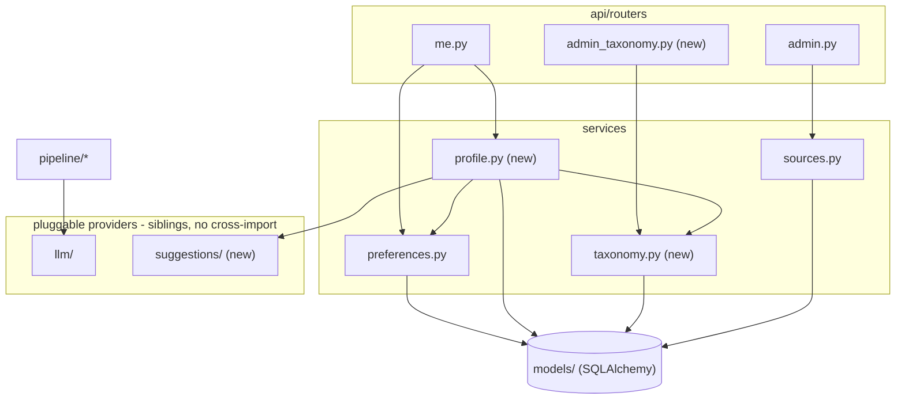

# Architecture Spine - Profile-Based Topic Suggestions

## Design Paradigm

news-agent is a thin-router / domain-service FastAPI app: routers take a `Session` + validated Pydantic schema, delegate to a pure service function, and translate the service's `ValueError` into `HTTPException`. Services own get-or-create idempotency and business rules; they never leak into routers, and routers never touch SQLAlchemy models directly. Layers map to namespaces:

- `newsagent/api/routers/` - HTTP boundary (auth guards, request/response schemas)
- `newsagent/services/` - business rules, mutation, idempotency
- `newsagent/models/` - SQLAlchemy ORM, no behavior beyond relationships

A second, narrower pattern governs anything LLM-adjacent: a pluggable-provider (Strategy) sub-pattern - ABC with template-method retry (`llm/base.py`), typed frozen-dataclass contracts speaking domain language (`llm/types.py`), and a factory keyed by a `Settings` string (`llm/factory.py`). This feature adds a second, independent instance of that sub-pattern (`newsagent/suggestions/`) rather than inventing a new shape or reusing the existing one - see AD-3.

Both patterns are already load-bearing in the current codebase (`services/preferences.py`, `services/sources.py`, `llm/*`); nothing here introduces a new paradigm, only extends the existing two.

## Invariants & Rules

### AD-1 - Thin-router / domain-service layering `[ADOPTED]`

- **Binds:** all new routers and services (`admin_taxonomy.py`, `me.py` additions, `services/taxonomy.py`, `services/profile.py`)
- **Prevents:** business logic or validation leaking into routers, or a router reaching past its service into models directly
- **Rule:** routers depend only on services; services take `(Session, plain args)` and return plain data/dataclasses; services own get-or-create idempotency and raise `ValueError` on bad input, which routers translate to `HTTPException`. No new layer is introduced for this feature.

### AD-2 - Review-queue status shape `[ADOPTED]`

- **Binds:** `PendingTaxonomySuggestion`, `admin_taxonomy.py`
- **Prevents:** inventing a second, incompatible review-state mechanism (enum type, boolean flags, separate promoted/dismissed tables) alongside the one `Source` already uses
- **Rule:** `PendingTaxonomySuggestion.status` is a plain string column with values `pending` / `approved` / `rejected` - the same shape as `Source.status` (`STATUS_PENDING` / `STATUS_APPROVED` / `STATUS_REJECTED`). "Promote" transitions a row to `approved` (and separately upserts the real `Field`/`Role` row); "dismiss" transitions it to `rejected`. No enum/constraint type, no separate state table.

### AD-3 - Pluggable-provider sub-pattern for suggestions `[ADOPTED]`

- **Binds:** `newsagent/suggestions/*`, `config.py:suggestion_provider`
- **Prevents:** the Suggestion Source being wired as a variant of `LLMProvider`/`llm_provider` (since it happens to also call an LLM), which would couple two deliberately separate deployments/cost paths; also prevents a second, differently-shaped ABC/factory/contract convention appearing alongside `llm/`
- **Rule:** `newsagent/suggestions/` mirrors `newsagent/llm/`'s exact shape - an ABC with template-method retry (`base.py`), frozen-dataclass domain-language contracts (`types.py`), and a dict-keyed-by-settings factory (`factory.py`) - selected by a new, independent `NEWSAGENT_SUGGESTION_PROVIDER` setting, never `NEWSAGENT_LLM_PROVIDER`. `suggestions/` and `llm/` are siblings; neither package imports the other. MVP ships a `popularity` adapter implementing only `suggest_topics` (FR-9's non-LLM fallback); `suggest_roles` and `suggest_prompts` return empty until an `LLMSuggestionSource` is connected behind the same interface. Like existing `llm/` providers, `suggestions/` providers never touch the DB directly - the calling service (`services/profile.py`) queries whatever aggregate data a provider needs (e.g. the popularity adapter's cross-user Topic-selection counts) and passes it as plain arguments; a provider reaching into `models/` directly would break the same purity contract `llm/` already relies on.

### AD-4 - Alembic is the established migration convention `[ADOPTED]`

- **Binds:** every new table/column this feature adds (`fields`, `roles`, `pending_taxonomy_suggestions`, new `User` columns)
- **Prevents:** a builder inventing an ad hoc schema-change mechanism (hand-written `ALTER TABLE`, a fresh `create_all`, a second migration tool) alongside the tool the project already uses for every prior schema change
- **Rule:** Alembic is fully wired (`alembic/env.py` → `Base.metadata`) with 8 existing revisions in `alembic/versions/`, most recently `d1a2b3c4d5e6_article_image_url.py` (#24). This feature's new tables/columns ship as a new Alembic revision, following that exact precedent - no `create_all`, no hand-written DDL.

### AD-5 - Async suggestion computation via in-process BackgroundTask

- **Binds:** the profile-save endpoint, `newsagent/suggestions/` call site
- **Prevents:** one build path bolting suggestion computation onto the scheduled pipeline process (a separate process, different session lifecycle) while another expects it inline/synchronous within the API request - two incompatible execution models for the same operation; also prevents two overlapping saves racing on which result "wins"
- **Rule:** suggestion computation runs as a FastAPI `BackgroundTask` fired after the profile-save response, inside the API process. No task queue is introduced; it is not piggybacked on the scheduled pipeline. Accepted tradeoff: lost on crash/restart, retried only via the provider adapter's own retry (mirrors `llm/base.py`'s retry-then-typed-error contract). The request handler sets `User.suggestion_status = 'pending'` **synchronously, before returning** (never left to the BackgroundTask itself) - a poll immediately after save must never see stale `none`/`ready` from a prior save. The handler also bumps a monotonic `User.suggestion_request_seq` (int) synchronously; the BackgroundTask captures that seq at dispatch time and only writes its result if the seq is still current when it finishes - a superseded (re-saved-over) computation discards its result instead of overwriting a newer one.

### AD-6 - Profile fields flat on `User`, "Other" is a UI concept only

- **Binds:** `User` model, `services/profile.py`, `newsagent/suggestions/`, `services/taxonomy.py`
- **Prevents:** a second builder introducing a separate `UserProfile` table/join for the same data, so two shapes for "the user's profile" coexist; also prevents a second builder inventing a *separate* override column per concept (`field_id` + `field_other_text`) when "Other" only ever needed to change what's *shown* in the picker, not how the value is *stored*
- **Rule:** `field_name`, `role_name`, `experience_bucket`, `interest_free_text` are direct columns on `User`, not a separate table - explicit user preference ("keep it simple for now, may change later"), documented as revisitable, not an oversight. `field_name`/`role_name` are **plain strings, not foreign keys** to `Field`/`Role` - a picked-from-list value and an "Other"-typed value are stored identically, one column each, no override column. (A strict FK couldn't hold unmatched "Other" text anyway, since `Field`/`Role` stay admin-curated per AD-2/AD-8.) Anywhere a stored name needs to resolve against the curated list - scoping a `suggest_roles`/`suggest_topics` call (AD-3), or checking whether a `PendingTaxonomySuggestion` duplicates an existing curated entry - that's a name-lookup (case/whitespace-normalized) against `Field.name`/`Role.name` at use time, never a stored FK id.

### AD-7 - Suggestion result surfaced via polling columns + endpoint

- **Binds:** `User.suggestion_status`, `User.suggested_topic_ids`, `User.suggestion_request_seq`, `GET /me/topic-suggestions`
- **Prevents:** the frontend and backend independently inventing different ways to learn suggestion state (websocket, SSE, a differently-shaped response) once the save request itself can't carry the answer
- **Rule:** `User` gets `suggestion_status` (string: `none`/`pending`/`ready`/`failed`), `suggested_topic_ids` (JSON list of topic ids), and `suggestion_request_seq` (int, see AD-5's race guard), written by the BackgroundTask (except `suggestion_status='pending'` and the seq bump, which the request handler sets synchronously per AD-5). `GET /me/topic-suggestions` is the only read path for suggestion state; the frontend polls it after save until status is `ready` or `failed`. Keeps the same "flat on `User`" shape as AD-6.

### AD-8 - `PendingTaxonomySuggestion` upsert shape

- **Binds:** `PendingTaxonomySuggestion`, `services/taxonomy.py`
- **Prevents:** one row per submission plus a query-time `GROUP BY` for "count of users who submitted the same text" (FR-6) - a second read path could aggregate (normalization, scoping) differently and disagree with the first; also prevents a post-decision resubmission silently mutating an already-`approved`/`rejected` row instead of surfacing as new
- **Rule:** one row per unique `(kind: field|role, field_id [nullable for kind=field], normalized_text)` **scoped to `status='pending'`**, upserted with an incrementing `submission_count` on repeat submissions - matches the existing get-or-create idiom (`add_topic`/`add_source` in `services/sources.py`), not one-row-per-submission-plus-groupby. A submission matching text whose only existing row is `approved`/`rejected` creates a **new** `pending` row rather than reopening or incrementing the decided one - the admin's pending-only list must never silently miss a resubmission behind an invisible terminal row.

### AD-9 - 4-Topic cap enforced in the shared mutation point

- **Binds:** `services/preferences.py:set_preferences`, every caller (existing toggle-grid PUT, new guided-flow save)
- **Prevents:** the new guided flow enforcing the cap while the existing raw toggle-grid save bypasses it (or vice versa) - a "platform-wide" rule that's only half-real because two save paths independently decided where to check it; also prevents the two paths surfacing the same failure as two different-looking errors
- **Rule:** the guided flow's Topic-selection step calls `services/preferences.py:set_preferences` directly for its Topic write (see Dependency direction: `profile → preferences`) - it does not duplicate the write via a second path. The 4-Topic hard cap (FR-10) is enforced inside that single existing mutation point for `UserTopicPreference`, raising a dedicated `TopicCapExceededError(ValueError)` (→ `HTTPException(400, detail={"error": "topic_cap_exceeded", ...})`) - a stable, identifiable shape both the old grid and the new guided flow surface identically, not a generic `ValueError` string two frontends would end up sniffing differently.

### AD-10 - Separate `admin_taxonomy.py` router

- **Binds:** `admin_taxonomy.py`, `admin.py` (unchanged)
- **Prevents:** taxonomy-approval logic creeping into `admin.py` and blurring two independent review concerns (source approval vs. taxonomy approval) that happen to share a shape
- **Rule:** a new `admin_taxonomy.py` router, same shape as `admin.py` (`require_admin` dependency, `GET` list-pending + promote/dismiss endpoints under an `/admin` prefix), lives in its own file rather than extending `admin.py` - matching the existing router split (`auth.py`/`me.py`/`tracking.py`/`admin.py`, one concern per file).

### Dependency direction



## Consistency Conventions

| Concern | Convention |
| --- | --- |
| Naming (entities, files, interfaces, events) | New models singular class names (`Field`, `Role`, `PendingTaxonomySuggestion`) matching `Topic`/`Source`; new tables plural snake_case (`fields`, `roles`, `pending_taxonomy_suggestions`). New endpoints follow the existing `/me` and `/admin` prefix + resource-noun pattern (e.g. `PUT /me/profile`, `GET /me/topic-suggestions`, `GET`/`PATCH /admin/taxonomy/{id}`). |
| Data & formats (ids, dates, error shapes, envelopes) | Status fields stay plain strings (never enum/constraint types), matching `Source.status`. `suggested_topic_ids` is a JSON list of ints. Service errors are raised as `ValueError` subclasses and translated to `HTTPException(400)` at the router boundary; a domain-identifiable failure (e.g. the 4-Topic cap, AD-9) uses a named `ValueError` subclass carrying a stable `detail={"error": "<code>", ...}` dict, not a bare string a caller would have to sniff - the first such subclass this feature introduces, so it's the precedent, not yet a project-wide pattern to assume elsewhere. |
| State & cross-cutting (mutation, errors, logging, config, auth) | All mutation goes through domain services - never a router writing a model directly. New settings are added as new `Settings` fields with the `NEWSAGENT_` prefix (e.g. `NEWSAGENT_SUGGESTION_PROVIDER`), never a differently-prefixed or ad hoc env var. Admin endpoints keep using the existing `require_admin` dependency; user endpoints keep using `require_user`. |
| Frontend controls | Chip/pill/segmented-control components (Field, Role, Experience, Topic pills) must be real semantic elements - `<button>` with `aria-pressed`, or native `radio`/`checkbox` inputs - never a `<div onclick>`. The UX mockup's div-based pattern was an explicit shortcut, not an approved pattern (tracked as news-agent#31); two independently-built components diverging on this is exactly the accessibility regression this convention exists to prevent. |

## Stack

No new dependencies - this feature reuses the existing stack unchanged (FastAPI, SQLAlchemy, Pydantic v2 / pydantic-settings, Vue 3 + Tailwind CSS, no component library). `suggested_topic_ids` uses SQLAlchemy's existing `JSON` column type; no new package is required for it.

## Structural Seed

```text
src/newsagent/
  models/
    user.py                        # CHANGED: + field_name, role_name (plain strings, not FK -
                                    #   AD-6), experience_bucket, interest_free_text,
                                    #   suggestion_status, suggested_topic_ids, suggestion_request_seq
    field.py                       # NEW: Field
    role.py                        # NEW: Role (FK -> Field)
    pending_taxonomy_suggestion.py # NEW
    __init__.py                    # CHANGED: export new models
  services/
    preferences.py                 # CHANGED: set_preferences enforces the 4-Topic cap (AD-9)
    profile.py                     # NEW: save profile fields, fire suggestion BackgroundTask
    taxonomy.py                    # NEW: Field/Role/PendingTaxonomySuggestion get-or-create,
                                    #   list-pending, promote/dismiss (mirrors sources.py)
  suggestions/                     # NEW sibling package to llm/ (AD-3)
    base.py                        # SuggestionSource ABC, template-method retry
    types.py                       # frozen-dataclass contracts (RoleOption, PromptText, TopicSuggestion, ...)
    factory.py                     # get_suggestion_source(), keyed by NEWSAGENT_SUGGESTION_PROVIDER
    popularity.py                  # PopularitySuggestionSource - MVP adapter, suggest_topics only
    __init__.py
  api/
    routers/
      me.py                        # CHANGED: + PUT /me/profile, GET /me/topic-suggestions
      admin_taxonomy.py             # NEW: GET list-pending + promote/dismiss (mirrors admin.py)
    schemas/
      profile.py                   # NEW: profile in/out schemas
      taxonomy.py                  # NEW: taxonomy suggestion in/out schemas
  config.py                        # CHANGED: + suggestion_provider setting

alembic/versions/
  {rev}_profile_topic_suggestions.py  # NEW: Alembic revision for all schema changes above (AD-4)

frontend/src/
  views/
    PreferencesView.vue            # CHANGED: mounts the new profile-picker section
    AdminTaxonomyView.vue          # NEW: taxonomy queue, mirrors AdminView.vue
  components/
    profile-picker/                # NEW: Field/Role/Experience/Interest/Topic step components
                                    #   (Hybrid Depth identity, per DESIGN.md/EXPERIENCE.md)
```

### Core entities

```mermaid
erDiagram
    USER ||--o{ USER_TOPIC_PREFERENCE : has
    TOPIC ||--o{ USER_TOPIC_PREFERENCE : "selected via"
    FIELD ||--o{ ROLE : scopes
    FIELD ||--o{ PENDING_TAXONOMY_SUGGESTION : "field_id (nullable; only for kind=role)"
    FIELD ..o{ USER : "matched by name at use time (no FK, AD-6)"
    ROLE ..o{ USER : "matched by name at use time (no FK, AD-6)"

    USER {
        int id PK
        string email
        string field_name
        string role_name
        string experience_bucket
        string interest_free_text
        string suggestion_status
        json suggested_topic_ids
        int suggestion_request_seq
    }
    FIELD {
        int id PK
        string name
    }
    ROLE {
        int id PK
        int field_id FK
        string name
    }
    PENDING_TAXONOMY_SUGGESTION {
        int id PK
        string kind
        int field_id FK
        string normalized_text
        int submission_count
        string status
    }
    TOPIC {
        int id PK
        string name
    }
    USER_TOPIC_PREFERENCE {
        int id PK
        int user_id FK
        int topic_id FK
    }
```

## Capability → Architecture Map

| Capability / Area | Lives in | Governed by |
| --- | --- | --- |
| FR-1 Field selection | `models/field.py`, `services/taxonomy.py`, `PUT /me/profile` | AD-1, AD-4, AD-6 |
| FR-2 Role selection (scoped to Field) | `models/role.py`, `suggestions/` (`suggest_roles`), `services/taxonomy.py` | AD-1, AD-3, AD-6 |
| FR-3 Experience Bucket | `User.experience_bucket` | AD-6 |
| FR-4 Interest Free-Text | `User.interest_free_text` | AD-6 |
| FR-5 Suggested Prompts | `suggestions/` (`suggest_prompts`) | AD-3 |
| FR-6 View pending taxonomy suggestions | `admin_taxonomy.py`, `PendingTaxonomySuggestion` | AD-2, AD-8, AD-10 |
| FR-7 Promote / dismiss taxonomy suggestion | `admin_taxonomy.py`, `services/taxonomy.py` | AD-2, AD-10 |
| FR-8 Suggestion generation (async) | `services/profile.py` BackgroundTask, `GET /me/topic-suggestions` | AD-5, AD-7 |
| FR-9 Always-available fallback | `suggestions/popularity.py` | AD-3 |
| FR-10 4-Topic cap | `services/preferences.py:set_preferences` | AD-9 |
| Frontend chip/pill/segmented controls | `frontend/src/components/profile-picker/` | Consistency Conventions row "Frontend controls" |

## Deferred

- **Which local LLM model/hosting powers the future `LLMSuggestionSource` adapter.** Separate infra decision (PRD Open Question 2); this spine only fixes the interface it must implement (AD-3).
- **Existing-user migration for the new 4-Topic cap.** Users who already have more than 4 Topics selected under the current unlimited grid need an explicit product/data decision at rollout (grandfather / trim / prompt) - not an architectural invariant (PRD §8, Open Question 3).
- **Exact Experience Bucket boundaries.** PM decision per PRD §4.1 FR-3 Notes - this spine treats the bucket set as an illustrative, swappable value list, not a fixed schema constraint.
- **Responsive/mobile design and full accessibility remediation** for the profile-picker surface. Tracked as news-agent#30 (responsive/mobile) and news-agent#31 (semantic-control follow-through beyond the baseline convention fixed above) - UX/frontend implementation work, not an architectural invariant.
- **Whether news-agent-infra's LLM cost-control system needs to treat the future suggestion-source model as a second, distinct cost path** from the article-generation LLM (PRD §8, Open Question 2) - an infra-owned decision, coordinated across repos, not fixed here.
- **Real Field/Role seed content validation** against the two actual dogfood users' real roles (PRD §8, Open Question 1) - a content/PM decision, not architecture.
- **Direct progress-stepper-dot navigation.** Left unimplemented in the UX mock (EXPERIENCE.md); whether to build it is a UX/product call, not fixed here.
- **Auto-migrating a promoted "Other" Field/Role onto users who originally submitted it as free text.** Explicitly rejected as a PRD non-goal (§4.2 FR-7 consequence, §9 Assumptions Index) - not revisited by this spine.
- **Automated (LLM- or analytics-driven) Role-list growth.** Admin stays the sole owner of Field/Role curation indefinitely, even once the Suggestion Source is LLM-connected; proactive flagging of when a Field's Role list needs growing is tracked separately as news-agent#29 (PRD §4.2 FR-7 Notes), not built now.
