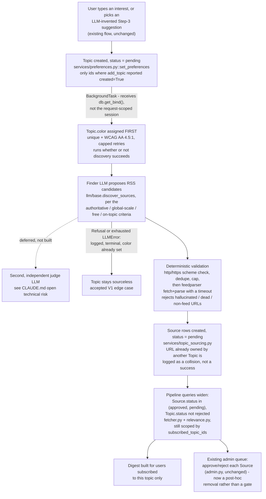

# Discovery Flow

Dashed edge = explicitly not built in this feature (CAP boundary, see SPEC.md Constraints/Non-goals). Color assignment sits ahead of the finder deliberately: it must not depend on an LLM call succeeding (CAP-2). Everything else is a strict top-to-bottom sequence gated by the step above it; no branch fans back upstream.
