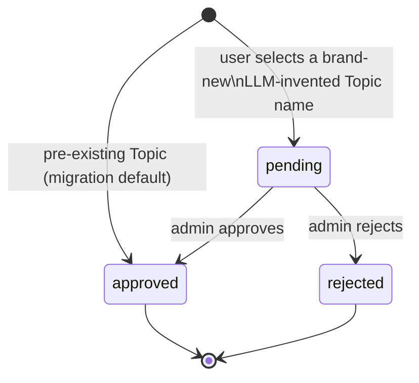

# Topic status: states and transitions

Mirrors `Source.status`'s existing shape (`pending` / `approved` / `rejected`), applied to `Topic` instead of `Source`.

## Transition table

| From | To | Trigger | Who can trigger | Effect |
|---|---|---|---|---|
| *(none)* | `approved` | Migration runs | System (one-time) | Every pre-existing `Topic` row defaults to `approved` - zero behavior change |
| *(none)* | `pending` | User picks a not-yet-existing suggested Topic and saves | Any authenticated user | `Topic` row created (get-or-create by exact name) + `UserTopicPreference` created for that user |
| `pending` | `approved` | Admin approves | Admin only | Topic becomes suggestible to all users |
| `pending` | `rejected` | Admin rejects | Admin only | Topic becomes **permanently** unsuggestible to anyone but the original user |
| `rejected` | *(none)* | - | - | Terminal. No un-reject path exists. |
| `approved` | *(none)* | - | - | Terminal for this feature. No re-review path exists (an approved Topic is never revisited). |

## Visibility matrix

| Status | Visible to the topic's own creator (their `GET /me/preferences`) | Offered as a suggestion candidate to *other* users |
|---|---|---|
| `pending` | Yes | No |
| `approved` | Yes | Yes |
| `rejected` | Yes (their own subscription still works) | No |
