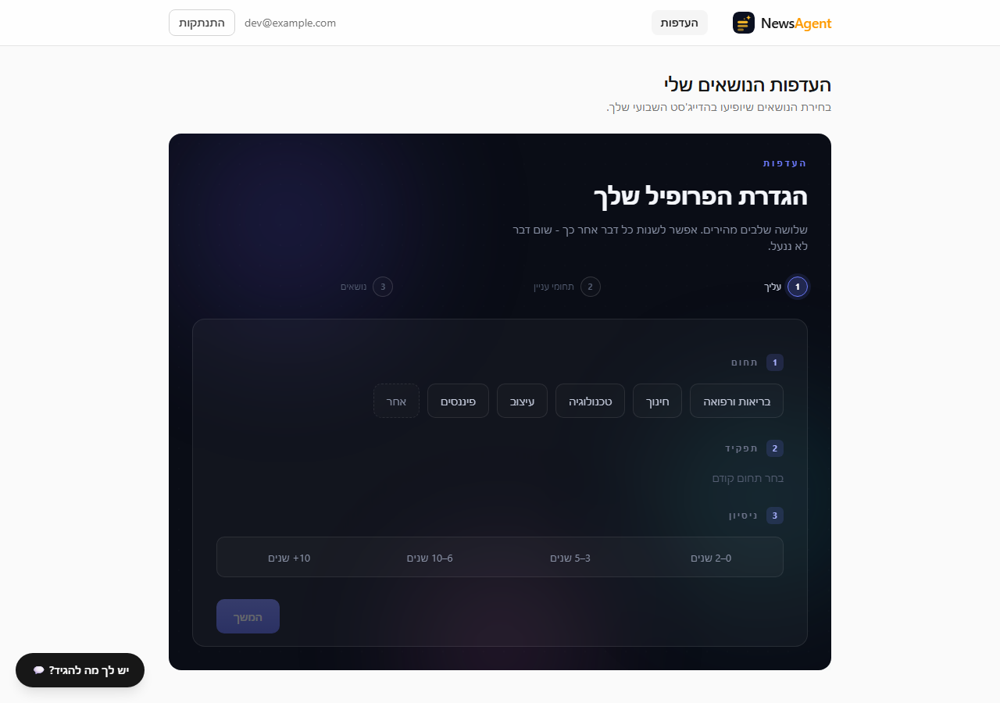
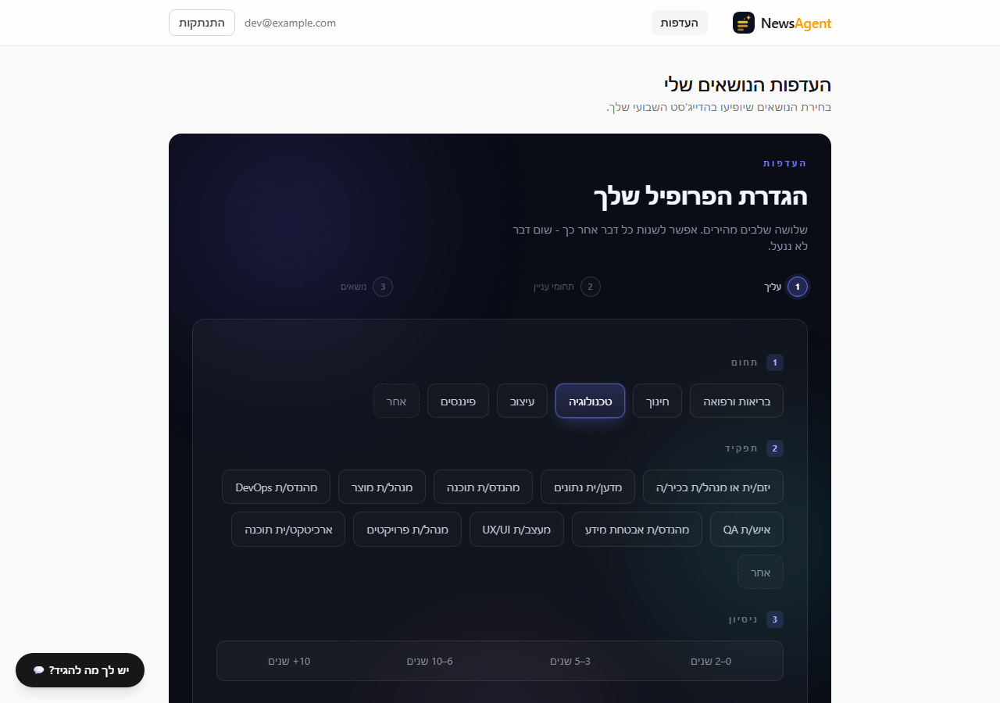
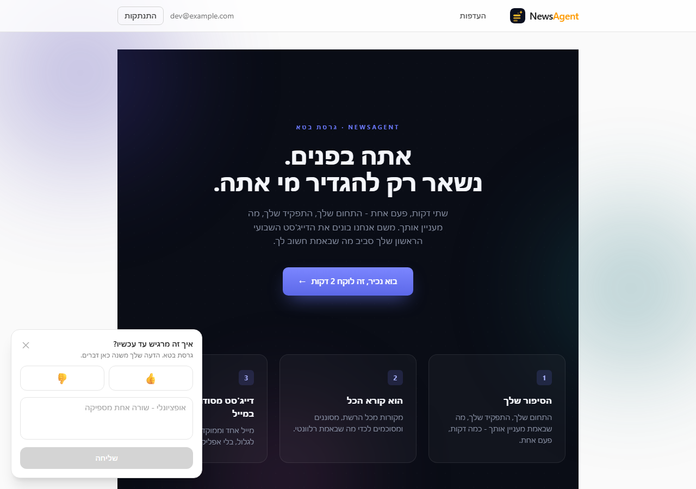
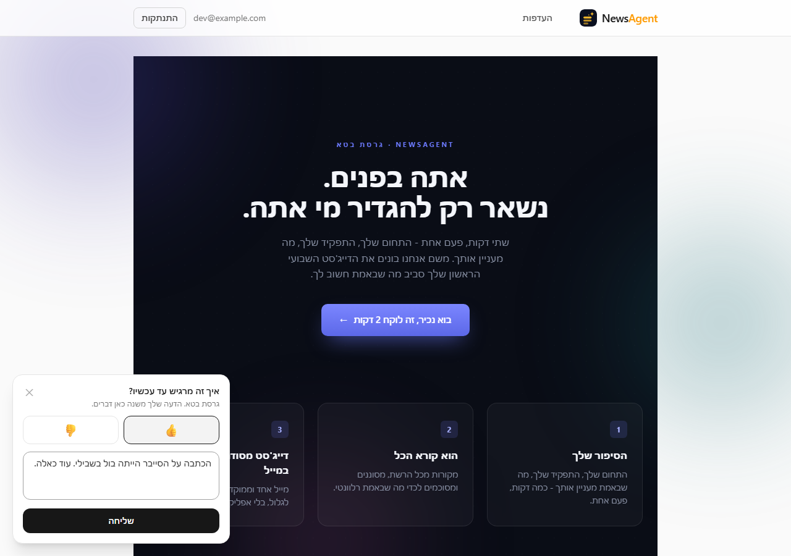
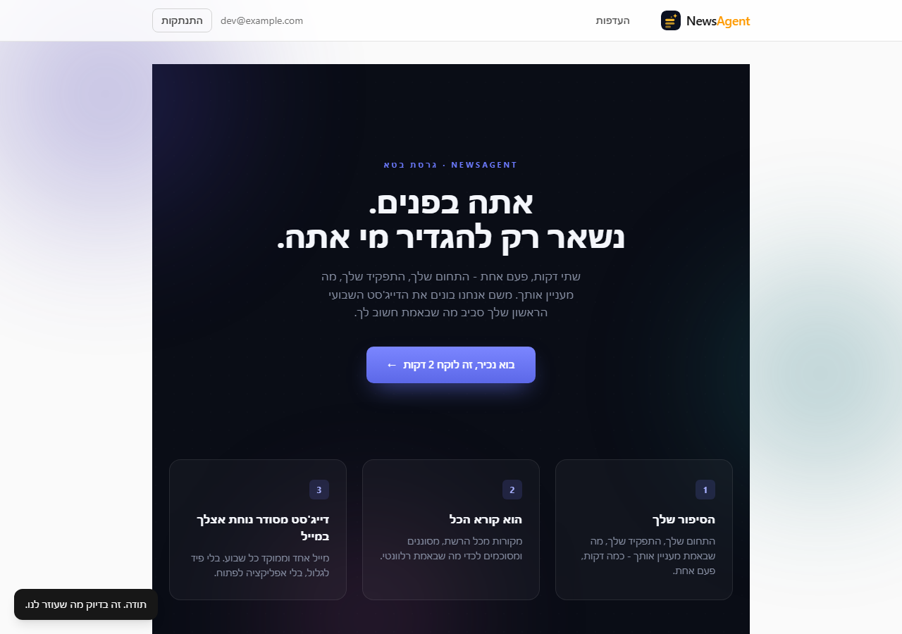
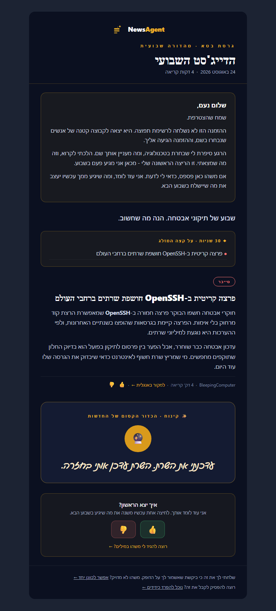
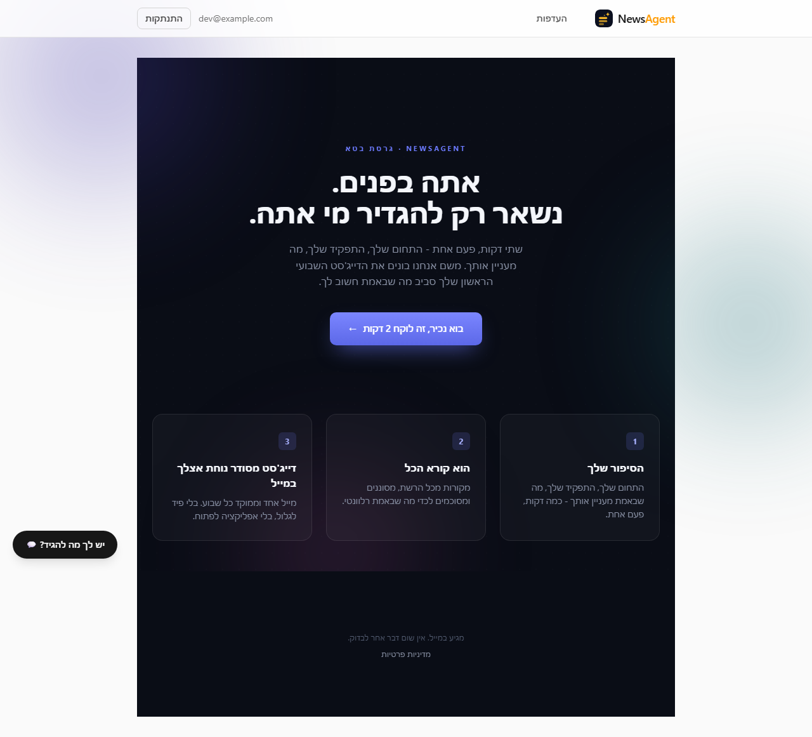
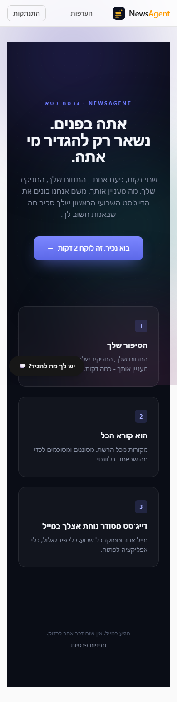

# V1 urgent fixes — what was asked, what shipped

**Date:** 2026-08-24
**Status:** implemented and tested on a branch; nothing committed or deployed yet.

This records the launch-blocking gaps raised for the beta, what was actually built for
each, and what is still open. Screenshots are from a real local run against a seeded
database, not mockups.

---

## The beta reader's journey, and where it broke

The five things a beta reader was supposed to experience, and their state before this work:

| # | Expected | Before |
|---|---|---|
| 1 | They register and understand the product | Copy existed but leaned on "דייג'סט", a word the reader does not necessarily know |
| 2 | Two minutes to say who they are | Field/Role/Topic options were in **English**, and topics were auto-picked for them |
| 3 | First email within minutes | **Did not exist.** Delivery only ran when a human typed a CLI command |
| 4 | They know they are a beta reader, chosen deliberately | **Did not exist** |
| 5 | Easy, fun feedback — no sign-in, no essays | **Did not exist** |

---

## 1. Logo click returns to the home page

The masthead brand was a plain `<span>`, so it looked clickable and did nothing.

- **Web:** now a `router-link` to `/` — `frontend/src/App.vue`
- **Email:** the masthead is wrapped in `<a href="{{ home_url }}">`, with `home_url` passed
  from `render.py` — `src/newsagent/templates/digest.html.j2`

Verified in the browser: the header renders as `link href="/"`.

---

## 2. "דייג'סט" — centralised, not yet renamed

The word appeared in the subject line, the email masthead, the landing page and the
preferences screen. It is now a single constant in two places:

- `src/newsagent/branding.py` — `DIGEST_NOUN`, `DIGEST_NOUN_WEEKLY`
- `frontend/src/branding.ts` — the same two values

**The name itself is still undecided**, so the constant deliberately still reads
"הדייג'סט". Renaming later is a two-line edit rather than a hunt across six files.

### Subject line now carries the hook

Before: `הדייג'סט השבועי שלך - 2026-08-23` — a date never earned an open.

Now the subject leads with the product and the top-ranked headline
(`_subject()` in `src/newsagent/pipeline/send.py`):

```
NewsAgent · פרצה קריטית ב-OpenSSH חושפת שרתים ברחבי העולם
```

The first email is different again, because its climax is getting in at all:

```
נעם, הדייג'סט הראשון שלך מוכן.
```

The headline is trimmed at a word boundary to survive Gmail's mobile preview.

---

## 3. Everything in Hebrew, including the profile options

Two separate causes, both fixed.

**Stored names were English.** `DEFAULT_FIELDS`, `DEFAULT_ROLES` and the seeded Topic
names were "Tech", "Software Engineer", "AI". Migration `d7f3a4b91e28` renames the rows —
and, critically, also `users.field_name` / `users.role_name`, which are denormalised
string copies that would otherwise point at names that no longer exist. Verified against a
database with real rows: fields, roles, topics and the user's saved profile all converted.

`_TOPIC_LABELS` in `render.py` was deleted rather than translated — the Topic name *is*
Hebrew now, so a second mapping to keep in sync would be a bug waiting to happen.

**The LLM was answering in English.** The deeper cause: the three prompts in
`src/newsagent/suggestions/llm.py` that generate user-facing text (`_suggest_roles`,
`_suggest_prompts`, `_suggest_new_topics`) never told the model which language to reply
in, so it defaulted to the prompt's own. They now carry a shared `_HEBREW_OUTPUT_RULE`
that also keeps established technical terms intact rather than forcing awkward
translations.



Live proof of the prompt fix — the roles below mix curated entries with LLM-generated ones
("מהנדס/ת DevOps", "מעצב/ת UX/UI", "ארכיטקט/ית תוכנה"), all in Hebrew:



---

## 4. Feedback — one model, three entry points

One `feedback` table (migration `e8a1c39d7b45`), deliberately append-only and permissive:
no unique constraint, `sentiment` and `text` both nullable, `user_id` nullable. Tapping 👍
twice leaves two honest rows. **Leaving feedback must never fail.**

| Entry point | Route | Auth |
|---|---|---|
| 👍/👎 beside each article in the email | `GET /c/{token}` | The token itself |
| "How was this week?" block in the email footer | `GET /c/{token}` | The token itself |
| Floating button in the app | `POST /me/feedback` | Session |

The email path reuses the existing `DigestLink` token mechanism rather than introducing a
second token table, so click tracking comes free and a retried send reuses the same token.







Confirmed persisted, not just rendered:

```
feedback rows:
  (1, 1, 'app', 'up', 'הכתבה על הסייבר הייתה בול בשבילי. עוד כאלה.')
```

---

## 5. Flowing paragraphs instead of bullet points

This was not a template change. The summary was stored as `bullets_he` — a JSON list
written from what the LLM returned — so rendering it as prose would just have produced the
same three fragments with spaces between them.

- The field was renamed to `paragraphs_he` (migration `f2b6d81a04c7`). A field name that
  lies about its content is exactly the drift that bites later.
- The summarize prompt in `src/newsagent/llm/external.py` now asks for one or two flowing
  paragraphs and **explicitly forbids** bullets, fragments and leading dashes.
- The template renders `<p>` elements instead of `<ul>/<li>`.

**Carry-over:** articles already summarised keep the old shape until they are summarised
again. Existing bullets render as very short paragraphs — degraded, not broken.

---

## 6. The beta welcome, and the immediate first email

### The welcome

`users.welcomed_at` (migration `b3d8f0c25e47`) marks the one-time welcome as delivered. It
is stamped **only after a successful send**, in the same commit, so a failed send leaves it
null and the retry still carries the welcome rather than silently downgrading the reader's
first email to an ordinary digest. The migration backfills readers who already receive
digests, so the first send after deploy does not greet an existing reader as brand new.

Copy decisions:

- **Warm and personal**, written in the agent's first person — extending the voice the
  footer already used ("שלחתי לך את זה כי ביקשת שאשמור לך על הדופק").
- **Free of gendered address.** Hebrew cannot write second-person present tense without
  picking a gender, so every line uses past tense and forms spelled identically for both
  ("הצטרפת", "סיפרת", "אליך"). Slashed forms were rejected as cold.
- **The user cap is never disclosed.** Exclusivity comes from the negation — "ההזמנה הזו
  לא נשלחה לרשימת תפוצה" — not from a number, which would invite "so why can't my friend
  join?" and break the moment the cap changes.



### The email with no articles

A reader whose chosen topics produce nothing gets **no `Digest` row at all**, so the normal
send path could never reach them — the promised "email in a few minutes" would have been
silence. `send_pending_welcomes` sends a welcome-only variant instead. It carries no 👍/👎:
there is nothing to rate yet, and those links are `Digest`-scoped tokens that do not exist
in that render.

### The scheduler

Delivery previously ran only when someone typed a CLI command. There was no cron anywhere —
not in this repo, and not in `news-agent-infra`, which contains only a source list.

`src/newsagent/scheduler.py` is a long-lived loop, run as a second container from the
existing backend image:

```bash
docker run <backend-image> python -m newsagent.scheduler
```

Each tick (every 2 minutes) builds for readers still owed a first email, builds for readers
whose cadence is due, then sends once.

**Why a 2-minute loop is affordable:** building a digest costs an LLM call for the
editorial voice, but `cadence.due_user_ids()` is a single query that usually returns
nobody. The cheap question gates the expensive action, so an idle tick costs two SELECTs
and no LLM call. The ordering is the mechanism, not the interval.

**Overlap is handled in both directions.** Within one process there is none by
construction — the loop sleeps *after* the tick returns, so a slow tick delays the next one
instead of running beside it (a real cron would not give this for free). Across processes,
a lease row (`scheduler_lease`, migration `d4a7b2c85f16`) lets exactly one instance deliver;
the rest skip. The lease expires rather than requiring release, so a killed holder recovers
on its own.

---

## Related fixes found along the way

### A beta reader was auto-subscribed to topics they never chose

Reported as: *"why did I only get four topics? two of them about autism, even though I
typed something completely different."*

`TopicsStep.vue` auto-selected the first four suggestion chips, and the ordering put
LLM-**invented** topic names right after the real ones. An invented topic is created as
`status='pending'` with **no RSS sources**, so those two slots could only ever produce zero
articles — half of a beta reader's subscription, dead.

Now only real, curated topics are pre-selected. Invented names stay on screen, unselected,
for the reader to choose deliberately. Two existing tests had encoded the buggy behaviour
as expected and were rewritten.

### Editing a profile left the old topics attached

`save_profile` overwrote Field/Role/interests but never touched `UserTopicPreference`.
Someone switching from טכנולוגיה to בריאות kept receiving AI and cyber articles.

`users.topics_stale_at` (migration `a9c4e71b3f60`) is set when an input that topic
suggestions derive from actually changes, and only for a reader who already has
subscriptions. A banner in `PreferencesView.vue` offers to refresh them; the subscriptions
themselves are never silently cleared, because quietly muting a beta reader is worse than
leaving them stale.

### A new signup no longer pays to rewrite the same news

The only per-digest LLM cost is `_compose_voice`. A new reader with no engagement history
gets neutral topic affinity, so they rank identically to other new readers on the same
topics and land on the same articles — and the LLM would be asked to write the same intro
again. `_reuse_recent_voice` copies the voice from a digest built in the last 3 days on the
**exact same article set**.

Matched on articles rather than topics deliberately: the voice is written *from* the
headlines, so borrowing across different sets would open a digest by naming stories it does
not contain.

**Article summarisation was already paid once, globally** — the Hebrew text lives on the
shared `Article` row, and `summary_status` stops a finished article being reselected. Two
tests now lock that in, including one asserting that ten new readers joining the same topic
cost zero additional calls.

---

## Landing page





---

## Test coverage

| Suite | Result |
|---|---|
| Backend (`pytest`) | 575 passed |
| Frontend (`vitest`) | 128 passed |
| Type check (`vue-tsc`) | clean |
| Migrations to head | 9 applied, verified on a fresh database |

---

## Still open

**Blocking V1** — both filed and labelled `urgent`:

- [#59 — Digest frequency picker in the UI](https://github.com/MONS-Designers/news-agent/issues/59).
  The column, the interval mapping and the scheduler all honour per-reader cadence
  already; only the picker is missing, so everyone is on `weekly`.
- [#60 — Expand the topic pool beyond the three seeded topics](https://github.com/MONS-Designers/news-agent/issues/60).
  Personalisation cannot outrun its candidate pool. Three topics for every reader is the
  single biggest limit on how good the first email can be.

**Decided, deliberately not fixed:**

- A digest can be delivered twice if the process is killed between the SMTP handoff and the
  `sent_at` commit. SMTP and the database share no transaction, so the window cannot be
  closed, only pointed the other way (at-most-once, risking a silent loss instead). Recorded
  with the alternatives in
  `_bmad-output/implementation-artifacts/deferred-work.md`.

**Not yet decided:**

- The Hebrew name replacing "דייג'סט".
- The landing page's first-run headline still reads "אתה בפנים. נשאר רק להגדיר מי אתה." —
  gendered, unlike the email copy, which was deliberately written neutral. Worth aligning.
- Nobody has run the scheduler in production yet; it needs a second container from the
  existing image, with the database URL and the SMTP settings.
